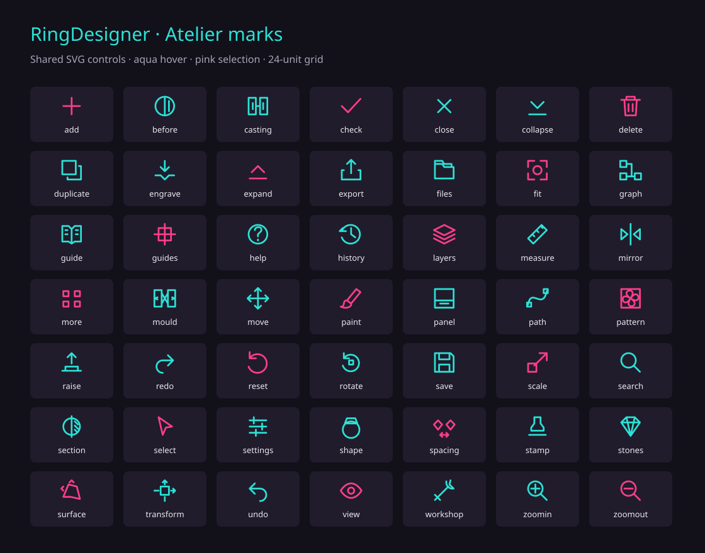

# Visual editing and workflow — 0.17.0

The toolbar uses 49 original SVG marks drawn on a shared 24-unit grid. Short
labels remain on editing tools; Undo/Redo, Guide, Panel and palette chrome use
icons to save space. Hold an icon for 0.65 seconds to read its purpose and use;
releasing a hold does not activate it. Pen hover opens hints after 0.7 seconds.

The Guide gives five entry points: fit, shape, decorate, set stones, inspect and
export. It navigates the current project without replacing it. Stamp selectors
show actual alpha thumbnails, preserve image proportions, support search and
virtualize the grid. The placement overlay follows the ring's surface chart,
including the alpha's aspect, rotation, reflection and feather. It previews the
artwork footprint; committing builds the actual relief and applies layer masks.
Stationary touch placement keeps its preview through the system's long-press
gesture and commits once on release, so pausing to inspect does not cancel it.
Undo also captures an edit still inside Android's history debounce before
stepping back; an immediate tap can no longer skip the newest change.

| Android | Desktop |
| --- | --- |
| [Alpha thumbnails](images/icon-workflow/android-alphas.png) · [Pen preview](images/icon-workflow/android-alpha-preview.png) · [Touch preview](images/icon-workflow/android-touch-preview.png) | [Workflow and movable controls](images/icon-workflow/desktop-workflow.png) |
| [Pen hint](images/icon-workflow/android-pen-help.png) · [Workflow](images/icon-workflow/android-workflow.png) · [Toolbox outside the viewport](images/icon-workflow/android-floating-toolbox.png) | |

Move ornament edits existing stamps, including individual instances inside
manual nested groups. Select by the raised artwork or the named instance list.
Drag the centre across the surface, the circular handle horizontally to rotate,
or the square vertically to resize. Exact values are also available. Apply
commits once; Copy offsets a new instance around the band, and Mirror adds a
reflected instance across it. The owner, masks and blending survive these edits.
Generated recipes remain responsible for their outputs; stale drafts cannot
write over a changed project. The existing limit is 64 stamps per layer.

Android palettes now use the full safe app rectangle and their measured height
for drag bounds. The inspector keeps a 24-point grip and visible Expand control;
the top Panel button also recovers a minimized or hidden inspector. Desktop
viewport inspectors are movable windows, and floating controls have opaque
backgrounds so text beneath them does not interfere.

Android's pen hover enters egui before hit testing. A steady hover sample is
coalesced instead of continually restarting the hint timer. Android wakes at
200 ms intervals to detect an approaching pen on backends that drop hover-only
window events; active hover repaints at 16 ms intervals. Contact input takes
precedence, and hover exit clears the pointer.

## Validation

- 599 distinct native tests passed: 449 core, 118 Android, 11 workbench and 21 GUI.
  Coverage includes nested masks and Undo, atomic rejection, copies/reflection,
  stale drafts, preview UV agreement, SVG rendering, hold/release behaviour,
  compact layout, hover scaling, stationary-sample coalescing and placement
  surviving egui's long-touch conversion until release.
- Desktop release and WASM configurator checks pass. Android ARM64 and x86_64
  packages retain the installed signer and pass ZIP integrity, 16 KB ZIP/ELF
  alignment, package, launcher and version checks.
- `tools/icon_workflow_review.py` replays the observed Android UI using live
  widget bounds and explicit layout waits. Both minimum-panel recovery routes,
  a toolbox wholly outside the viewport, hold help, normal Guide activation and
  byte-for-byte preservation of the design passed.
- `tools/RingDesignerPenHover.java` injects native Android stylus hover events.
  The Guide highlights and shows its delayed hint; pointer coordinates convert
  correctly from physical pixels to UI points. This verifies the Android input
  path in the emulator; physical S-Pen pressure, palm rejection and Samsung GPU
  behaviour still require a hardware run.

ARTEMIS final verification (`036b9cb8-c0a7-47d2-af92-435ebb23b318`) recorded
10 passed checks, no failures and one inconclusive transient-preview capture
because its video extraction failed. It verified a Floral stamp, a centre-handle
move plus Apply, Copy, and three Undo steps. The final project SHA256 matched the
baseline exactly: `421d42eeec8dee20edf1dc79c5d33825ebea7d1817c6f6b51a296387940b804f`.

Direct ADB captures resolved the transient-preview check: the Floral artwork is
visible during native stylus hover and 1.6 seconds into a stationary 3.5-second
finger hold. The hold leaves the source unchanged until release, adds exactly
one stamp layer, and Undo restores the same baseline bytes.
The final Android package also passed a rapid Stamp → Undo → Redo → Undo
sequence: the Undo command completed 351 ms after the stamp command, Redo
restored one stamp, and the last Undo restored the original bytes. Completed
viewport gestures enter history immediately; muted Undo/Redo buttons keep
stable tap targets across frames so rapid touch input is not lost.

The shoulder geometry and manufacturing review from
[0.16](SURFACE-TOOLS-REVIEW.md) remains applicable. The next modelling increments
are [stone settings along paths, direct sweeps/lofts and surface inspection](NEXT-VIEWPORT-TOOLS.md).

## Published release

Android **0.17.0**, version code **16781568**, was published to the
[app store](https://appstore.shadowbroker.app) on 2026-09-16 from the source
merged in `9f66336`. The update feed, release entry and downloaded ARM64 APK
match the reviewed package: 13,747,071 bytes, SHA-256
`fff3cb8b9f488f9635cf675b8807092eeba33a977074c6aad3d594caaabf489b`.
The signing certificate matches 0.16.0.

Taildrop confirmed all eight review PNGs sent to the S26. Build artifacts and
receipts are in `target/releases/ringdesigner-android-0.17.0/`; the desktop
release is in `target/releases/ringdesigner-desktop-0.17.0/`.
