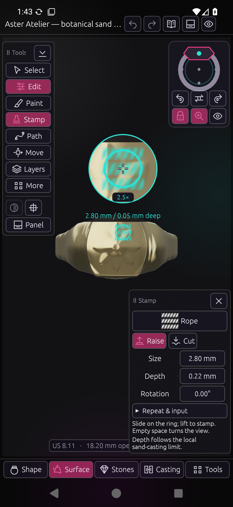

# Placement and navigation — 0.18.0

Desktop and Android share a live 2.5× placement loupe, a ring navigator and
contact routing for visual editing. Stamp and Path palettes are 180 points
wide on Android (previously 250), with advanced settings below the main actions.

| Control | Behaviour |
| --- | --- |
| Touch the mesh with Stamp, Path, Paint or Move | Edit with a close-up of the actual surface and overlay above the contact. The loupe moves beside the finger near the top edge. |
| Drag empty space with an editing tool active | Orbit. Crossing onto the mesh keeps the drag in navigation until release. |
| Lock icon on the small ring | Hold the view angle; empty-space drags pan. Two fingers still pan and zoom. |
| Parts of the small ring | Face, left/right shoulder, underside and through-opening views, relative to the signet's angle. |
| Arrows / flip | Exact quarter turns around the ring / the opposite viewpoint. These work while locked. |
| View menu on the navigator | Both openings, 3/4 view and 90° up/down tilts. |
| Magnifier icon | Enable or hide the placement loupe. Lock and magnifier preferences persist. |

[Path placement](images/placement-navigation/android-path-loupe.png) ·
[Compact Path palette](images/placement-navigation/android-path-palette.png) ·
[Locked shoulder view](images/placement-navigation/android-locked-shoulder.png) ·
[Desktop loupe](images/placement-navigation/desktop-stamp-loupe.png)

The loupe copies the completed GPU framebuffer after egui paints the actual
placement overlay. It has no CPU readback or second geometry build; the same
implementation supports desktop GL and Android GLES. The central crosshair
marks the contact. A 360-channel sample comparison against its 2.5× viewport
crop gave a mean absolute difference of 1.53 on the 0–255 colour scale.

A press chooses a tool handle or mesh editing contact once. Background drags
retain camera ownership, and explicit multi-touch/barrel navigation cancels
editing until release. Stationary Stamp and new Path contacts survive Android's
long-touch conversion. A Path point stays a draft until Add/Apply. Exact point
coordinates and repeat settings expand below Apply. Desktop now commits discrete
viewport edits immediately and flushes pending history before Undo/Redo.

## Validation

- 155 native tests passed: 16 workbench, 118 Android and 21 desktop. Coverage
  includes contact ownership across the mesh, explicit-navigation cancellation,
  view directions, quarter turns, opposite-view round trips, lens placement,
  168/180-point inspectors, source preservation, SVGs and held contacts.
- Desktop release and WASM configurator checks pass. Both Android ABIs pass
  signer continuity, package/version/launcher checks, ZIP integrity, 16 KB ZIP
  alignment and 16 KB ELF segment alignment.
- ARTEMIS baseline `d0803fcb-d013-4c32-bcdd-c9f8c0bbd1cb` reproduced the empty-space
  navigation failure in 0.17. Final run `9061a4c0-ccc4-4c09-aa95-f40b74af6e6c`
  passed six checks with no failures or inconclusive checks. Its optional video
  recorder failed; device screenshots, camera state and the check ledger were
  available for verification.
- `python3 tools/placement_navigation_review.py --serial emulator-5554` passed
  ten checks using live widget bounds, explicit state waits and verified contact
  locations. It exercises empty-space/cross-mesh drags in both tools, exact turns,
  locked pan, view changes while locked, loupe on/off, single-release placement,
  Undo, and held Path draft placement. It restores preferences and source files.
- Desktop mouse placement displayed the same live crop. A toolbar Undo completed
  about 202 ms after release, restored the 12-layer model and enabled Redo.
- Aster Atelier remained byte-for-byte unchanged: SHA256
  `421d42eeec8dee20edf1dc79c5d33825ebea7d1817c6f6b51a296387940b804f`, 12 layers.

Device tests used the Android 16 x86_64 emulator. Physical S26 touch, S-Pen and
Samsung GPU behaviour still need a hardware run. The loupe enlarges the existing
surface overlay; it does not predict the final relief height or replace casting
checks. Geometry changes from 0.16 remain included without further modification.
