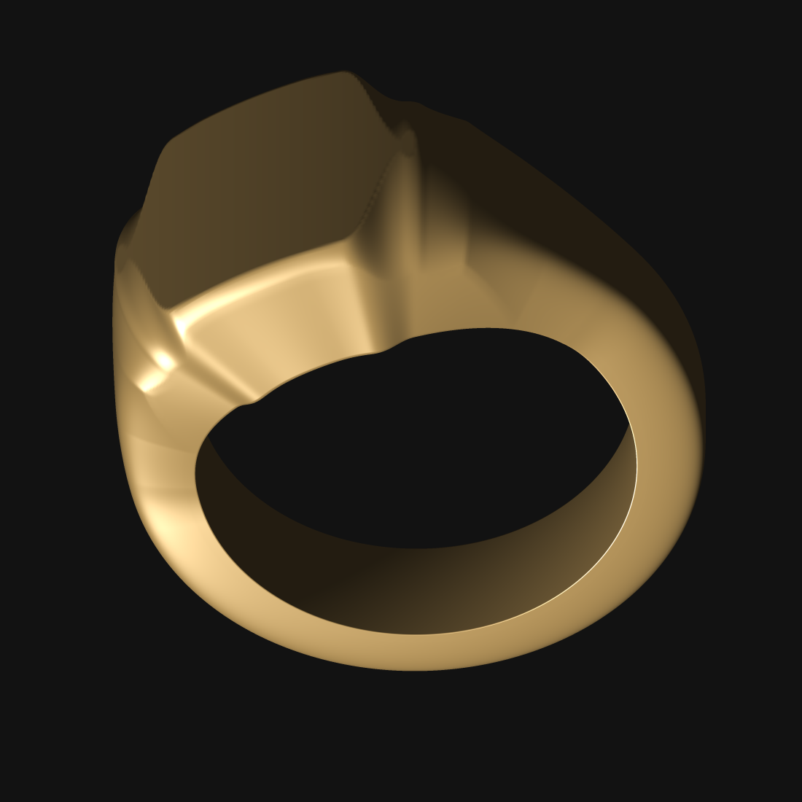
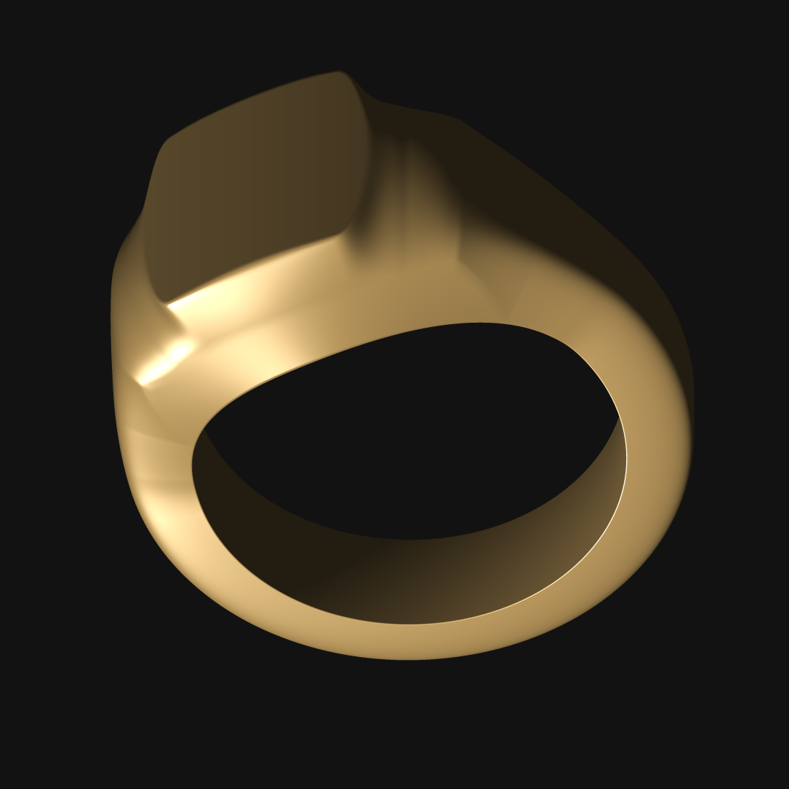

# Surface tools and shoulder review — 0.16.0

The Aster Atelier shoulder lines were present in the bare generated mesh, even
with its ornament removed. Increasing viewport resolution alone could not fix
them: the profile builder quantized fillet endpoints, and the cut-dome cap used
a hard minimum after an earlier smooth minimum had introduced an undercut lip.

The fix interpolates fillet tangencies, samples curved walls and fillets more
densely, and uses a monotone rounded cap that removes material at the join.
Comparing the local `Hexa-signet-size6to13.STL` reference exposed a second issue:
the dome carried the face's full bounding box down into the body, then lifted
the whole section to form its facet. That made a broad cheek shelf. The body
now follows one continuous taper, and the facet changes the crown while keeping
the side-wall join fixed. The face retains its distinct perimeter. Desktop,
Android and mesh exports all use this geometry.

| Bare Aster, same 720 × 320 sweep | Before | After |
| --- | ---: | ---: |
| Largest normal change below the table plane | 17.86° | 9.71° |
| 99th percentile below the table plane | 3.76° | 2.25° |
| 99.9th percentile below the table plane | 10.83° | 5.22° |
| Largest second difference in shoulder width per 0.5° step | 0.01268 mm | 0.00239 mm |
| Watertight | Yes | Yes |
| Finger opening | 18.20 mm | 18.20 mm |

The body measurements exclude the intentional face edge above its 13.60 mm
table plane. The sharper face perimeter reaches a 38.65° sample-to-sample
normal change; that is not a shoulder-continuity result. Intentional flutes,
tight radii and head edges remain.

| Before | After |
| --- | --- |
|  |  |

The final 1920 × 640 ornamented manufacturing build has 2,457,600 triangles,
2.844 mm minimum sampled radial wall and a Castable field verdict. Mould-release
sampling at both 0.10 and 0.075 mm found zero obstructions and zero unresolved
cells. Its overall manufacturing status remains **Review**, including low-draft
bore/slot surfaces; this is not a physical casting trial.

## Tools on both apps

- **Surface path:** tap points, drag numbered handles, or enter ring angles and
  across-band millimetres; choose raised/engraved, width/depth, cross-section,
  taper, repeats and mirrored sides. Add/Apply commits one editable Curve layer.
  Existing top-level paths reopen through the selector; stale drafts cannot
  overwrite a changed project. Maximum 64 points and 128 repeats.
- **Stamp arrays:** circular or partial-arc placement with optional reflected
  artwork on the opposite side. Up to 32 copies/64 decals fit the field
  evaluator; a full circle does not duplicate its seam.
- **Measure:** two mesh picks report chord length and X/Y/Z spans without
  modifying the design. It measures the displayed mesh, not a geodesic or the
  global minimum wall.

## Validation

- Native checks: **726 passed**, zero failures in the merged workspace — 445
  core tests and 281 other workspace/golden checks. This includes the upstream
  asset-version, per-head construction and detail-scale regressions, plus the
  exact side-wall selector used by the new facet-width regression.
- Core regression coverage pins the shoulder continuity, bore and watertightness,
  monotone cap, fixed side wall under changing face width, seam-crossing paths,
  source roundtrip/Undo, mask preservation,
  array limits and reflected artwork. Shared inspector tests pin immediate
  application and refusal of stale drafts.
- The 33-row geometry corpus was regenerated because continuous fillet sampling
  intentionally changes geometry. Verdicts, watertightness and triangle counts
  are unchanged; maximum volume movement is 0.111% and maximum radial-wall
  movement is 0.029 mm. The configurator no longer offers a fixed crest bead row on
  the asymmetric heart: that row falls onto its moving flank and undercuts.
- Desktop runtime: place/apply a three-point path, remove it with Undo,
  and measure two points (9.134 mm, with XYZ spans).
- ARTEMIS on Android 16, emulator-5554, 1440 × 3120: nine checks passed for Path
  creation/drag/Apply/Undo, existing-curve loading and draft clearing, four-copy
  mirrored stamping/Undo, measurement (6.955 mm with XYZ), shoulder orbit and
  portrait/landscape controls. The saved 12-layer source matches its backup to
  1e-10 numeric tolerance. Trace: `d9b50bf1-cbb7-47b5-935f-49000b9877ee`.
- ARTEMIS video capture had an optional emulator encoder failure; screenshots
  and live UI checks completed. No physical Samsung GPU or S-Pen test was run.
- Final ARM64 and x86_64 APKs pass package/version, prior-certificate matching,
  ZIP integrity, 16 KB ZIP alignment and ELF segment checks. The final x86_64
  APK installs over the prior candidate, cold-starts, exposes Path controls and
  measures 6.950 mm with XYZ spans. Its saved source remains unchanged and its
  process log contains no panic/fatal exception/ANR. The final Linux release
  also opens Aster successfully; the wasm core/configurator check passes.

Release artifacts and verification receipts are under
`target/releases/ringdesigner-android-0.16.0/` and
`target/releases/ringdesigner-desktop-0.16.0/`. The corrected full manufacturing
package is `target/surface-review/anchored-manufacturing/pattern-package/`.

Reproduce the geometry comparison with
`cargo run -p ringdesign-core --example surface_quality -- SOURCE OUTPUT`.
Run tests under the repository's `MemoryMax=4G` cgroup guard.

See [next viewport tools](NEXT-VIEWPORT-TOOLS.md) for the remaining editor work.
