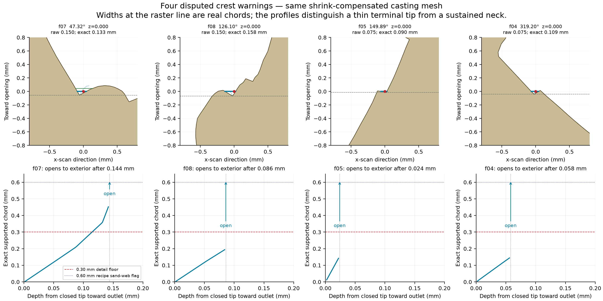

# Draco: casting-pattern sand-slot sections

**The stable 9081d76 candidate remains cut at 5.8/10 under the three-round art cap.** This investigation resolves the thin-slot evidence; it does not change the score.

All 31 raw sub-0.30 mm warnings are accounted for in 23 distinct section features. Thirty external observations reach a 0.30 mm chord or an unbounded side outlet within 0.116 mm of their terminal tip. The remaining observation is a tangent to the broad bore. No sustained thin neck is demonstrated by these sections.

The raw warnings are valid narrow chords; calling every one a raster error would be wrong. Their depth and side support make them shallow cusps or the tips of broader openings. `release.status` remains `Review`, and geometry cannot establish sand strength.

## Four explicit correlations

Measurements below use the same shrink-compensated casting-pattern STL as the release report. Depth is measured along the outward normal to the original scan line; an outlet begins when one flanking metal side ends. It is not the previous angular width 0.10 mm above a radial floor.

| Raw ID / angle | Exact scan chord | Local bay depth | Mouth just before outlet | 0.30 mm reached at tip depth |
|---|---:|---:|---:|---:|
| f07 / 47.32° | 0.1331 mm | 0.1416 mm | 0.4543 mm | 0.1138 mm |
| f08 / 126.10° | 0.1579 mm | 0.0848 mm | 0.1964 mm | opens sooner |
| f05 / 149.89° | 0.0900 mm | 0.0222 mm | 0.1435 mm | opens sooner |
| f04 / 319.20° | 0.1085 mm | 0.0570 mm | 0.1468 mm | opens sooner |



The 47.32° warning is the most persistent of the four: the actual gap is 0.133 mm at the raster line and widens to 0.30 mm after about 0.114 mm from its tip. The 149.89° and 319.20° findings are small kinks only about 0.022 and 0.057 mm deep in the scan direction, not slots between parallel thorn walls.

## Every distinct feature

The full data retain both passes, exact chords, tip and outlet coordinates, sampled opening profiles, and links back to every raw warning. `open` below means one side has already ended before the +0.10 mm section; it does not mean a zero-width neck.

| Feature | Raw IDs | Angle(s) | Bay depth | Width at tip +0.10 mm | Disposition |
|---|---|---|---:|---:|---|
| G01 | c01 | 295.43° | 0.088 mm | open | shallow external cusp |
| G02 | c03, f03 | 221.16°, 221.41° | 0.098 mm | open | shallow external cusp |
| G03 | c04 | 45.03° | 0.056 mm | open | shallow external cusp |
| G04 | c05, f07 | 47.30°, 47.32° | 0.144 mm | 0.252 mm | open bay with short terminal narrowing |
| G05 | c06, f08 | 126.43°, 126.10° | 0.086 mm | open | shallow external cusp |
| G06 | c07, f10 | 69.75°, 69.77° | 0.194 mm | 0.371 mm | open bay with short terminal narrowing |
| G07 | c09, f12 | 198.79°, 198.51° | 0.100 mm | open | shallow external cusp |
| G08 | c11 | 180.07° | bore cavity | 2.742 mm | bore tangency |
| G09 | c13 | 224.73° | 0.066 mm | open | shallow external cusp |
| G10 | c14 | 117.15° | 0.026 mm | open | shallow external cusp |
| G11 | c15, f18 | 315.87°, 315.62° | 0.116 mm | 0.350 mm | open bay with short terminal narrowing |
| G12 | c16, f19 | 328.38°, 328.54° | 0.192 mm | 0.334 mm | open bay with short terminal narrowing |
| G13 | c17, f20 | 342.20°, 342.25° | 0.322 mm | 0.365 mm | open bay with short terminal narrowing |
| G14 | c20 | 103.13° | 0.034 mm | open | shallow external cusp |
| G15 | f02 | 306.94° | 0.074 mm | open | shallow external cusp |
| G16 | f04 | 319.20° | 0.058 mm | open | shallow external cusp |
| G17 | f05 | 149.89° | 0.024 mm | open | shallow external cusp |
| G18 | f06 | 31.40° | 0.038 mm | open | shallow external cusp |
| G19 | f09 | 116.11° | 0.064 mm | open | shallow external cusp |
| G20 | f13 | 146.55° | 0.394 mm | 0.296 mm | open bay with short terminal narrowing |
| G21 | f15 | 121.04° | 0.034 mm | open | shallow external cusp |
| G22 | f17 | 303.38° | 0.058 mm | open | shallow external cusp |
| G23 | f21 | 16.39° | 0.132 mm | 0.666 mm | open bay with short terminal narrowing |

## Geometry recommendation

No broad thorn-shortening change is justified by this evidence. If the archived candidate is revisited, optional finishing of the sharp 47.34° cusp can use a 0.15 mm root radius across roughly 0.35 mm of contour, or fill its deepest 0.045 mm with pattern metal; retain the open side outlet and remeasure. This is a local finish refinement, not evidence that the current thorns will fuse.

## Files and method

- `all-warning-sections.csv`: one row for every raw warning.
- `measurements.json`: exact section data, 23-feature grouping, profiles and convergence.
- `contact-1.png` through `contact-4.png`: every warning section, with vector PDFs produced when rerun.
- `four-correlated-sections.png` (PDF produced when rerun): common-scale diagrams for the four disputed points.
- The parent Draco folder supplies the regenerated pattern mesh and reports; the measured mesh SHA-256 is recorded in `measurements.json`.
- `analyze.py`, `measure.py`, `finalize.py`: diagnostic reproduction scripts.

Triangle-plane intersections are computed analytically on the 1,342,302-triangle casting pattern at z=0 and z=5.690816402 mm. Sand chords are traced toward the exterior with a 0.002 mm step. Five sections were repeated at 0.0002 mm; bay depths changed by at most 0.0024 mm. The mesh carries scale 1.019367991845056. The fine release grid is capped at 384 cells along Y, giving actual pitch 0.074832 × 0.081112 mm.

Reproduce from the repository root:

```sh
python3 showcase/bestiarium/draco/sand-sections/analyze.py
python3 showcase/bestiarium/draco/sand-sections/measure.py
python3 showcase/bestiarium/draco/sand-sections/finalize.py
```
